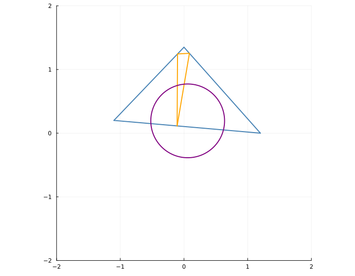

# Demo: Triangle Construction

This page shows a small example using Constructions.jl to build a triangle, its midpoints,
centroid, and (if non-degenerate) the circumcircle. Plotting is optional via Plots.jl.

Rendered figure (SVG, built during docs):


Animation (APNG):


```julia
using Constructions
using Plots

point(x, y) = (x = float(x), y = float(y))
midpoint(P, Q) = point((P.x + Q.x) / 2, (P.y + Q.y) / 2)

function circumcenter(A, B, C)
    ax, ay = A.x, A.y
    bx, by = B.x, B.y
    cx, cy = C.x, C.y
    d = 2 * (ax * (by - cy) + bx * (cy - ay) + cx * (ay - by))
    iszero(d) && return nothing
    ux = ((ax^2 + ay^2) * (by - cy) + (bx^2 + by^2) * (cy - ay) + (cx^2 + cy^2) * (ay - by)) / d
    uy = ((ax^2 + ay^2) * (cx - bx) + (bx^2 + by^2) * (ax - cx) + (cx^2 + cy^2) * (bx - ax)) / d
    O = point(ux, uy)
    r = hypot(O.x - ax, O.y - ay)
    (center = O, radius = r)
end

C = Construction()
@place C "A" point(-1.0, 0.2)
@place C "B" point(1.0, 0.0)
@place C "C" point(0.0, 1.2)

@construct(C, "M_ab", midpoint, "A", "B")
@construct(C, "M_bc", midpoint, "B", "C")
@construct(C, "M_ca", midpoint, "C", "A")
@construct(C, "G", (A,B,C) -> point((A.x+B.x+C.x)/3, (A.y+B.y+C.y)/3), "A", "B", "C")
@construct(C, "circ", circumcenter, "A", "B", "C")

# See examples/triangle_construction.jl for a full plotting version.
```

For animation, see `examples/triangle_animation.jl`. It updates `C["C"]` over time using `@modify` and records frames with Plots’ `@animate`.

## Same idea, simpler with PGA2D

If you have PGA2D available, the geometric helpers are already provided, so the construction code becomes smaller. Below is a sketch (not executed in docs for determinism):

```julia
using Constructions
using PGA2D  # provides point(), incenter_ppp, circumcircle_ppp, etc.
using Plots  # optional, for visualization

C = Construction()
@place C "A" point(-1.0, 0.2)
@place C "B" point( 1.0, 0.0)
@place C "C" point( 0.0, 1.2)

# Triangle centers and circles via PGA2D helpers
@construct(C, "I", incenter_ppp,     "A", "B", "C")          # incenter (point)
@construct(C, "circ", circumcircle_ppp, "A", "B", "C")        # NamedTuple (center, radius)

# Example visualization (requires PGA2D plotting extension to be loaded)
# scatter!(C["A"], C["B"], C["C"]; label="A,B,C")
# let cc = C["circ"]; cc !== nothing && plot!(cc) end
```

You can animate similarly by updating the placed point `"C"` in a loop via `@modify C "C" point(x(t), y(t))`. All dependent elements (incenter, circumcircle) update automatically.

See also:
- `examples/triangle_construction_pga2d.jl`
- `examples/triangle_animation_pga2d.jl`

## CAD-style example: Filleted rectangle

This example mimics a common 2D CAD operation: filleting rectangle corners with a radius `r`.
It shows how driving dimensions (w, h, r, center) propagate through dependent geometry.


Animated (APNG):


Try the full examples:
- `examples/cad_fillet_rectangle.jl`
- `examples/cad_fillet_rectangle_animation.apng.jl`

## Triangle symmedians (Lemoine point)

A classic olympiad-grade construction: the three symmedians of a triangle are concurrent at the Lemoine point K. One way to obtain symmedians is via isogonal conjugation of the medians (reflect each median across the corresponding internal angle bisector).

Below is a PGA2D-based example (not executed in docs for determinism). The full plotting version is available under `examples/triangle_symmedians_pga2d.jl`.

```julia
using Constructions
using PGA2D

C = Construction()
@place C "A" point(-1.1, 0.2)
@place C "B" point( 1.2, 0.0)
@place C "C" point( 0.0, 1.3)

# Lemoine point K via barycentric weights a^2:b^2:c^2
# (See full example for details and plotting.)
```

Rendered figure (SVG, built during docs):


See also the full script:
- `examples/triangle_symmedians_pga2d.jl`

## Euler line and Nine-point circle

Another classic: O (circumcenter), H (orthocenter), and G (centroid) are collinear on the Euler line, with NG = GO = GH/2. The Nine-point circle has center N (midpoint of O and H) and radius half the circumradius.

Rendered figure (SVG, built during docs):


Full PGA2D example with plotting:
- `examples/triangle_ninepoint_euler_pga2d.jl`

## Simson line

For any point P on the circumcircle, the feet of the perpendiculars from P to the sides of the triangle are collinear (the Simson line).

Rendered figure (SVG, built during docs):


Full PGA2D example with plotting:
- `examples/triangle_simson_line_pga2d.jl`

## Miquel point

Given triangle ABC and points D, E, F chosen on sides BC, CA, AB (not at the vertices), the circumcircles of triangles (A,E,F), (B,F,D), and (C,D,E) concur at a single point: the Miquel point.

Rendered figure (SVG, built during docs):


Full PGA2D example with plotting:
- `examples/triangle_miquel_pga2d.jl`

## Brocard points

The Brocard points Ω1 and Ω2 have trilinears Ω1 = (c/b : a/c : b/a) and Ω2 = (b/c : c/a : a/b). They satisfy remarkable equal-angle properties at the triangle’s vertices.

Rendered figure (SVG, built during docs):


Full PGA2D example:
- `examples/triangle_brocard_pga2d.jl`

## Apollonius circles

For a ratio k > 0, the locus of points X with XB:XC = k is a circle (Apollonius circle). Each vertex yields a family of such circles.

Rendered figure (SVG, built during docs):


Full PGA2D example:
- `examples/triangle_apollonius_pga2d.jl`

## Orthic triangle and nine-point circle

The feet of the altitudes form the orthic triangle. The nine-point circle has radius half the circumradius and center at the midpoint of the circumcenter and orthocenter.

Rendered figure (SVG, built during docs):



Full PGA2D example:
- `examples/triangle_orthic_pga2d.jl`
